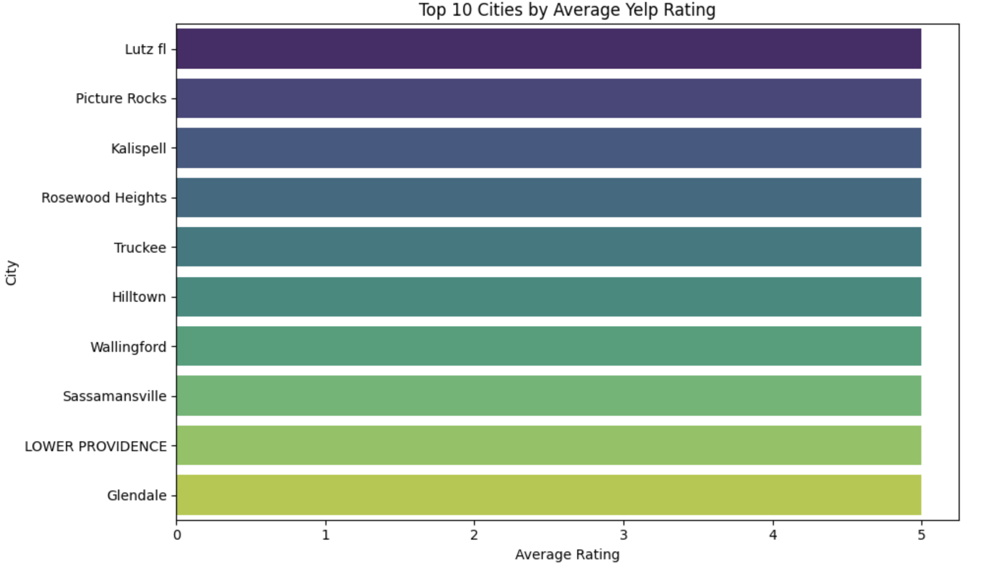
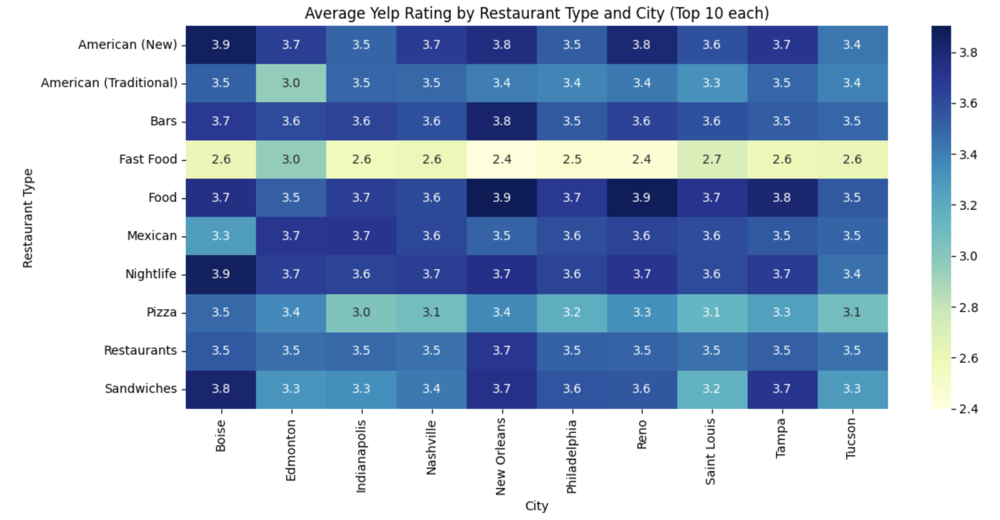

# Yelp Ratings Analysis

This project analyzes Yelp business data to uncover patterns in restaurant ratings across different cities, price levels, and restaurant types.

## Project Objectives
- Identify the top cities by average Yelp rating
- Explore the relationship between price level and rating
- Highlight the most common restaurant types
- Visualize regional rating patterns using heatmaps

## Data Source

This project uses the [Yelp Open Dataset](https://www.yelp.com/dataset), provided by Yelp as part of their Academic Dataset program.

The dataset primarily contains business, review, and user data from cities in the United States (e.g., Phoenix, Las Vegas, Charlotte). A few entries may also come from Canada (e.g., Toronto) or the United Kingdom (e.g., Edinburgh), but these are limited and may vary by dataset version.

All data is for academic research purposes only and complies with Yelp's data sharing policy.

## Files in This Repository

| File                                      | Description                              |
|-------------------------------------------|------------------------------------------|
| `analysis.py`                          | Main notebook with all visualizations    |
| `clean_business.py`                       | Script to preprocess Yelp data           |
| `yelp_academic_dataset_business.json.zip` | Raw dataset (compressed)                 |
| `yelp_cleaned.csv.zip`                    | Cleaned dataset (compressed)             |
| `images/`                                 | Folder containing all visualization images|

## Visualizations

### 1. Top 10 Cities by Average Rating

### 2. Rating Distribution by Price Level (Boxplot)

### 3. Rating vs Price Level (Linear Fit)

### 4. Top 10 Restaurant Types

### 5. Average Rating by State and Price Level (Heatmap)

## Tools and Libraries
- Python (pandas, seaborn, matplotlib, numpy)
- Jupyter Notebook

## How to Use
1. Clone the repository
2. Unzip datasets
3. Run `clean_business.py` to generate the cleaned dataset.
4. Open `analysis.ipynb` in Jupyter Notebook and run all cells.

## Environment
- Python 3.10+
- pandas, seaborn, matplotlib, folium

